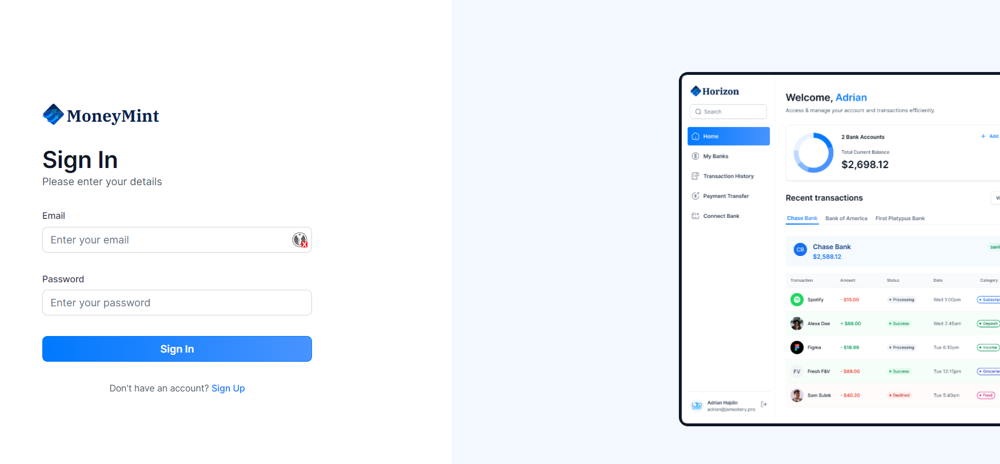
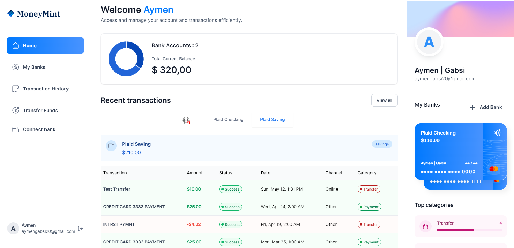

<div align="center">
  <br />
    <a href="https://moneymint-delta.vercel.app/" target="_blank">
      
    </a>
  <br />
  
  <div>
    
    
    
    
  </div>

  <h3 align="center">MoneyMint Bank Application</h3>
</div>

## 📋 <a name="table">Table of Contents</a>

1. 🤖 [Introduction](#introduction)
2. 🚀 [Live Demo](#demo)
3. ⚙️ [Tech Stack](#tech-stack)
4. 🔋 [Features](#features)
5. ✨ [Gallery](#gallery)
6. 🤸 [Quick Start](#quick-start)
7. 🕸️ [Code Snippets to Copy](#snippets)
8. 🔗 [Assets](#links)

## <a name="introduction">🤖 Introduction</a>

Built with Next.js, MoneyMint is a financial SaaS platform that connects to multiple bank accounts, displays transactions in real-time, allows users to transfer money to other platform users, and manages their finances altogether.

If you're getting started and need assistance or face any bugs, join our active Discord community with over **34k+** members. It's a place where people help each other out.

## <a name="demo">🚀 Live Demo</a>

**Here is a working live demo : https://moneymint-delta.vercel.app/**

## <a name="tech-stack">⚙️ Tech Stack</a>

<p align="left">
  <a href="https://skillicons.dev">
    
  </a>
  


</p>

<p align="center">
[ Next.js
- Appwrite
- React Hook Form
- TailwindCSS
- TypeScript
- Plaid
- Dwolla
- Zod
- Chart.js
- ShadCN]
  
</p>

## <a name="features">🔋 Features</a>

👉 **Authentication**: An ultra-secure SSR authentication with proper validations and authorization

👉 **Connect Banks**: Integrates with Plaid for multiple bank account linking

👉 **Home Page**: Shows general overview of user account with total balance from all connected banks, recent transactions, money spent on different categories, etc

👉 **My Banks**: Check the complete list of all connected banks with respective balances, account details

👉 **Transaction History**: Includes pagination and filtering options for viewing transaction history of different banks

👉 **Real-time Updates**: Reflects changes across all relevant pages upon connecting new bank accounts.

👉 **Funds Transfer**: Allows users to transfer funds using Dwolla to other accounts with required fields and recipient bank ID.

👉 **Responsiveness**: Ensures the application adapts seamlessly to various screen sizes and devices, providing a consistent user experience across desktop, tablet, and mobile platforms.

and many more, including code architecture and reusability.

## <a name="gallery">✨ Gallery</a>

<p align="center">
  
</p>
<p align="center">
  
</p>

## <a name="quick-start">🤸 Quick Start</a>

Follow these steps to set up the project locally on your machine.

**Prerequisites**

Make sure you have the following installed on your machine:

- [Git](https://git-scm.com/)
- [Node.js](https://nodejs.org/en)
- [npm](https://www.npmjs.com/) (Node Package Manager)

**Cloning the Repository**

```bash
git clone https://github.com/AymenGabsi/moneymint.git
cd moneymint
```

**Installation**

Install the project dependencies using npm:

```bash
npm install
```

**Set Up Environment Variables**

Create a new file named `.env` in the root of your project and add the following content:

```env
#NEXT
NEXT_PUBLIC_SITE_URL=

#APPWRITE
NEXT_PUBLIC_APPWRITE_ENDPOINT=https://cloud.appwrite.io/v1
NEXT_PUBLIC_APPWRITE_PROJECT=
APPWRITE_DATABASE_ID=
APPWRITE_USER_COLLECTION_ID=
APPWRITE_BANK_COLLECTION_ID=
APPWRITE_TRANSACTION_COLLECTION_ID=
APPWRITE_SECRET=

#PLAID
PLAID_CLIENT_ID=
PLAID_SECRET=
PLAID_ENV=
PLAID_PRODUCTS=
PLAID_COUNTRY_CODES=

#DWOLLA
DWOLLA_KEY=
DWOLLA_SECRET=
DWOLLA_BASE_URL=https://api-sandbox.dwolla.com
DWOLLA_ENV=sandbox

```

Replace the placeholder values with your actual respective account credentials. You can obtain these credentials by signing up on the [Appwrite](https://appwrite.io/?utm_source=youtube&utm_content=reactnative&ref=JSmastery), [Plaid](https://plaid.com/) and [Dwolla](https://www.dwolla.com/)

**Running the Project**

```bash
npm run dev
```

Open [http://localhost:3001](http://localhost:3001) in your browser to view the project.

## <a name="snippets">🕸️ Snippets</a>

<details>
<summary><code>.env.example</code></summary>

```env
#NEXT
NEXT_PUBLIC_SITE_URL=

#APPWRITE
NEXT_PUBLIC_APPWRITE_ENDPOINT=https://cloud.appwrite.io/v1
NEXT_PUBLIC_APPWRITE_PROJECT=
APPWRITE_DATABASE_ID=
APPWRITE_USER_COLLECTION_ID=
APPWRITE_BANK_COLLECTION_ID=
APPWRITE_TRANSACTION_COLLECTION_ID=
APPWRITE_SECRET=

#PLAID
PLAID_CLIENT_ID=
PLAID_SECRET=
PLAID_ENV=sandbox
PLAID_PRODUCTS=auth,transactions,identity
PLAID_COUNTRY_CODES=US,CA

#DWOLLA
DWOLLA_KEY=
DWOLLA_SECRET=
DWOLLA_BASE_URL=https://api-sandbox.dwolla.com
DWOLLA_ENV=sandbox
```

</details>

<details>
<summary><code>exchangePublicToken</code></summary>

</details>

<details>
<summary><code>user.actions.ts</code></summary>
</details>

## <a name="links">🔗 Links</a>

**Plaid website : https://plaid.com/** \
**Dwolla website : https://www.dwolla.com/**\
**Shadcn website : https://ui.shadcn.com/**\
**ChatJs website : https://www.chartjs.org/**\
